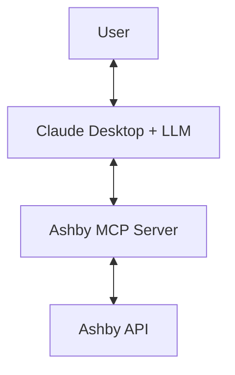
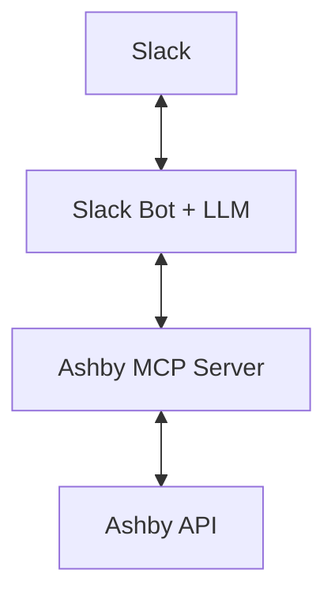

# Ashby Agent Architecture

This document describes the architecture and operational flow of the Ashby ATS MCP Server.

## System Overview

The Ashby MCP Server acts as a bridge between **Claude Desktop** and the **Ashby Applicant Tracking System (ATS)**. It leverages the **Model Context Protocol (MCP)** to expose ATS capabilities as executable tools for an AI agent.

```mermaid
graph TD
    User[User / Recruiter] <--> Claude[Claude Desktop]
    Claude <--> MCP[MCP Server (server.py)]
    MCP <--> Client[Ashby Client (ashby_client.py)]
    Client <--> API[Ashby REST API]
```

## Core Architecture

### 1. Transport & Protocol Layer (`server.py`)
- **MCP Protocol**: Uses the Stdio transport to communicate with Claude.
- **Tool Definitions**: Exposes 20+ specialized tools including pipeline summaries, candidate search, and write actions (notes, stage moves).
- **Instructions**: Injects `CLAUDE_INSTRUCTIONS.md` directly into the system prompt to define the "Recruiter Persona".

### 2. Interaction Layer (`ashby_client.py`)
- **API Wrapper**: A robust Python client handling authentication, base64 encoding, and error handling.
- **Pagination Logic**: Implements `_get_all_paginated` to handle large candidate lists (up to ~900 in current environment).
- **Caching**: Local in-memory caching for semi-static data like `jobs` and `interview_stages` to improve latency.

### 3. Intelligence Layer (`CLAUDE_INSTRUCTIONS.md`)
- **Recruiter Persona**: Guides the LLM to think proactively (e.g., flagging stale candidates, suggesting next steps).
- **Hard Constraints**: Enforces safety limits, such as a maximum of 5 candidates per batch operation.
- **Context Awareness**: Provides specific thresholds (e.g., 14 days for "stale") and stage definitions.

## Operational Flow

The Ashby MCP server can be used in two ways:

### Option 1: Claude Desktop (Current, Recommended)


**How it works:**
- Claude Desktop provides the LLM intelligence
- MCP server provides Ashby-specific tools and basic instructions
- User interacts directly with Claude Desktop

### Option 2: Slack Bot Integration (Future Roadmap)


**How it would work:**
- Separate Slack bot with its own LLM (OpenAI/Claude API)
- MCP server provides Ashby tools only (no LLM instructions)
- Bot handles conversation flow, context, and user permissions
- Team collaboration features added

**Important Distinction:** The MCP server provides **tools and data**, not LLM intelligence. The LLM always runs in the client application (Claude Desktop or future Slack bot).

### ✅ Current Implementation
- **Environment Mapping**: `ashby_map_setup` tool discovers Ashby configuration
- **Basic Access Levels**: READ_ONLY, COMMENT_ONLY, FULL_WRITE implemented
- **Safety Controls**: PII redaction, batch limits, hired candidate protection

### 🚧 Future Graduated Autonomy (Not Implemented)
The roadmap includes more granular access levels:
- **Level 1 (Schedule-only)**: Interview scheduling capabilities
- **Level 2 (Comment-only)**: Notes and feedback only
- **Additional Levels**: More precise permission controls

## Roadmap & Safety Goals

### Short-Term: The "Safe Adapter"
- **Adherence over Automation**: Focus on executing specific instructions (e.g., "Reschedule John Doe") precisely.
- **Clarification Loops**: The agent must proactively double-check identities ("Which John Doe? I found two.") and intent.
- **Deterministic Documentation**: Automate the mapping of the user's specific Ashby architecture to a local lexicon.

### Mid-Term: Privacy & Security (COMPLETED)
- **Data Redaction**: Automatic stripping of PII (emails, phones) and sensitive info for `USER` roles.
- **Access Control**: "Hired" candidates are restricted to `ADMIN` roles. Identity-aware note tagging implemented.
- **Environment Context**: GitHub safety logic via `ashby_strip_technical_pii` implemented for technical reviews.
- **Aggregate-only Stats**: Pipeline statistics restricted for non-admin users.

### Long-Term: local Context
- **Local Resume Ingestion**: Placeholder implemented for ingesting local files via automated flows.

## Summary of Constraints
- **Ashby as Source of Truth**: All actions go through Ashby (no direct Google Calendar/Gmail bypass).
- **No Database**: The MCP is a **Lexicon and Translator**, not a data store.
- **Privacy First**: Explicitly designed to prevent data leaks in shared channels.
